# SUB_PJT_01 (AI)

### 서울 1반 6팀 이민아


- **사전학습**

  - [사전학습1 인공지능](#사전학습1-인공지능)
  - [사전학습2 회귀 및 경사하강법](#사전학습2-회귀-및-경사하강법)
  - [사전학습3 신경망](#사전학습3-신경망)
  - [사전학습4 파이썬 라이브러리](#사전학습4-파이썬-라이브러리)

  

## 사전학습1 인공지능

### 1. 인공지능 

#### (1) AI

>  가장 광의의 개념으로 인텔리전트한 기계를 만드는 과학과 공학

#### (2) 머신러닝

>  머신(컴퓨터, 기계, 로봇)을 학습시키는 체계 및 플랫폼을 의미

- 지도학습 (Supervised Learning)  
- 비지도학습 (Un-supervised Learning)
- 강화학습 (Reinforcement Learning)

#### (3) 딥러닝

> 인간의 신경망을 차용하여 기계를 학습시킨다는 의미에서 협의의 AI로 인간의 신경망을 차용하여 학습시키는 머신러닝의 한 종류

- **입력층, 은닉층, 출력층, 활성화함수** 등
- RBM(Restricted Bolzman Machine)
  - Hidden node와 Visual node로 구성된 무방향 그래프
  - DBN의 기본단위
- DBN(Deep Belief Network)
  - RBM이 적층되어있는 구조
  - MNIST(손글씨) 분류
- **DNN(Deep Neural Network)**
  - 입력층과 출력층 사이에 다중의 **은닉층**으로 구성된 신경망
  - 범용, 이미지 인식
- **CNN(Convolution Neural Network)**
  - 인간의 시신경구조 모방한 **vision처리** 수행모델
  -   이미지 인식, 컴퓨터비젼
- RNN(Recurrent Neural Network)
  - **은닉층**에서 출력층간 데이터의 저장 및 흐름 가능한 신경망
  -   언어모델링, 기계번역, 이미지캡션생성

#### (4) 모델

>  머신러닝을 통해 얻을 수 있는 최종 결과물이며 가설(Hypothesis)이라고도 불림

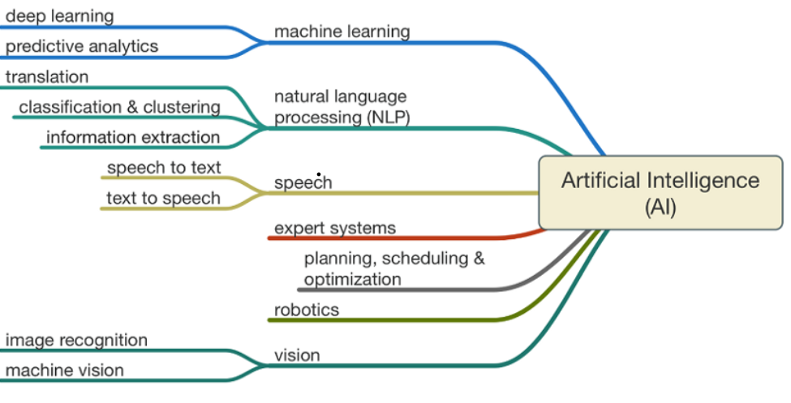

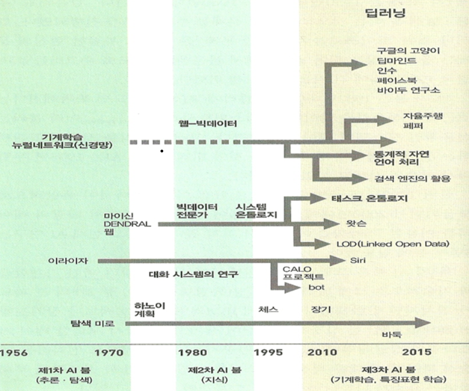


### 2. 머신 러닝 

#### (1) 지도학습

- **정답을 주고** 학습시키는 머신러닝의 방법론

- 입력데이터에 **라벨링이 되어** 있고 출력값으로 사상되는 사상되는 함수(활성화함수)를 학습하여 성능을 향상시키는 방향

- **분류 (Classification)** 

  - 값의 선택 및 분류 (**입력**데이터로 {입력, 정답}의 형태로  **정답은 ‘범주’의** 형태)

  - 주어진 데이터를 정해진 카테고리에 따라 분류하는 문제
  - 이메일이 스팸메일인지 아닌지를 예측한다고 하면 이메일은 스팸메일 / 정상적인 메일로 라벨링 
  - 종양이 악성종양인지 / 아닌지로 구분할 수 있습니다. 이처럼 맞다 / 아니다로 구분되는 문제를 **Binary Classification**
  - 수능 공부시간에 따른 전공 학점을 A / B / C / D / F 으로 예측하는 경우도 있습니다. 이러한 분류를 **Multi-label Classification** 

- **회귀 (Regression)** 

  - 연관된 측정값을 통한 예측 (**입력**데이터로 {입력, 정답}의 형태 정답은 **‘값’**의 형태)
  - 어떤 패턴이나 트렌드, 경향을 예측
  - 공부시간에 따른 전공 시험 점수를 예측하는 문제

| 기법                         | 설명                                                         |
| ---------------------------- | ------------------------------------------------------------ |
| **신경망(Neural Network)**   | 인간의 뉴런구조 차용한 모델. **입력층,은닉층,출력층, 활성함수** |
| 은닉마르코프모델(HMM)        | 전이확률(노드간 상태전이 확률), 발생확률(이벤트발생확률) 곱. 확률적 모델 |
| 의사결정트리                 | 트리형성, 정지규칙, 데이터의 분할로 이뤄짐. 예측목적         |
| 다층신경망(MLP)              | 다층 구조. 뉴런, 활성화함수, 잡음에 견고한 구조              |
| 지지벡터머신(SVM)            | 마진을 최대화하는 분류알고리즘. 빠른 학습                    |
| 베이지언망(Bayesian Network) | 확률적 모델. 변수간의 의존관계 학습                          |

#### (2) 비지도학습

- **정답없는 데이터**를 **어떻게 구성**되었는지를 알아내는 머신러닝의 학습 방법론
- 입력데이터는 **라벨링이 되어있지 않고** 입력된 패턴의 공통적인 특성을 파악하는 것이 목적
- **군집** : 그룹핑 (비슷한 데이터들끼리 묶어주는 기능)
- **특징** : 특징 도출

| 기법                         | 설명                                                  |
| ---------------------------- | ----------------------------------------------------- |
| K-means 알고리즘             | 군집별 중심에서 거리를 기반으로 그룹분류. K개의 군집. |
| **군집화(Clustering)**       | 데이터 그룹핑. 데이터집합을 군집화                    |
| 계층적 군집화                | 전체 데이터 계층 분할                                 |
| 자기조직지도(SOM)            | 층구조 신경망. 데이터의 가시화.                       |
| 주성분분석(PCA)              | 분산큰 데이터의 차원 축소. 특징 도출.                 |
| 독립성분분석(ICA)            | 독립성분 분석. 요인 분석                              |
| EM(Expectation Maximisation) | 통계모델. 최대가능도의 획득                           |

#### (3) 강화학습

- 입력된 데이터(행동)의 선택에 따른 보상에 따라 보상치를 극대화 

| 기법                  | 설명                                        |
| --------------------- | ------------------------------------------- |
| 몬테카를로 시뮬레이션 | 난수를 사용하여 함수의 값을 확률적으로 계산 |
| Q-Learning            | 유한 마르코프 과정의 최적정책 결정          |

#### (4) 프로세스

- 데이터 수집
- 입력 데이터 정제
- 데이터 분석(규칙, 가설)
- 모델(알고리즘) 선택, 훈련
- 검증, 테스트 진행
- 사용 및 배포

#### (5) 과적합 (Overfitting)

- **Overfitting** 

  학습 데이터에 **너무 최적화를** 하다보니, **실제 데이터와 차이가 많이** 발생하는 모델 생성

  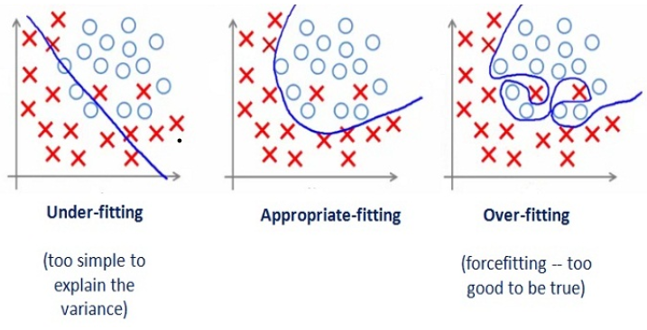

- **Regularization** 
  - 학습 데이터를 조금 희생하더라도 모델을 최대한 간단하게 만들어서 **Overfitting 방지 기법**
  - 눈으로 보고 쉽게 확인할 수 있지 않기 때문에 학습 과정에서의 Overfitting 판단 어려움

- **Validation** 

  - **Overfitting 여부를 손쉽게 판단**하기 위해


#### (6) 데이터

- 훈련데이터(Training Data)
- 시험데이터(Test Data)


### 3. 딥러닝

#### (1) 퍼셉트론 

- 퍼셉트론

  - 1957년 미국의 심리학자 프랑크 로젠블라트(Frank Rosenblatt)에 의해 고안된 **인공신경망 최초의 알고리즘**

  - 다수의 입력과 하나의 출력

  - 뉴런이라고도 부르며 뉴런은 입력, 가중치, 활성화함수, 출력으로 구성

    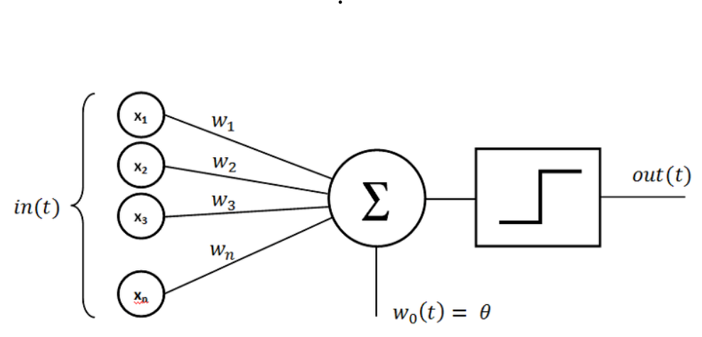

- 다층 퍼셉트론

  - 퍼셉트론은 AND, OR, NANA 같은 선형문제는 해결(분류) 가능하지만 **XOR 같은 비선형 문제**는 해결 불가능

  - XOR 문제를 분류하기 위해서는 직선이 아닌 **곡선으로 분류** 가능함
  - 단층 퍼셉트론에서 층을 증가시킴으로써, XOR 문제 해결 가능

#### (2) 인공신경망 (ANN)

- **단층 퍼셉트론을 기반**으로 생물학적 신경망 영감을 받은 **통계 학습 알고리즘**

- 심층신경망(DNN)의 기초

  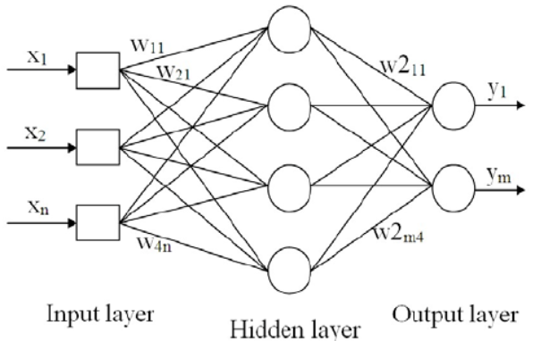

#### (3) 심층신경망 DNN(Deep Neural Network) 

- 정의

  - 인공신경망에서 **은닉 계층을 증가**시킨 신경망
  - 일반적으로 은닉층이 3개 이상일 경우, 심층신경망이라고 표현
  - **딥러닝**에 사용

- 프로세스

  - 학습에 사용할 데이터를 로드한다. (**Matrix 형태**로 변환)

  - **입력층**에서 가중치와 편향 값을 **활성화 함수와 경사 하강법**을 통해 출력값을 **은닉층**으로 전달한다.

  - **출력층까지 연산을 반복**한다.

  - 출력값을 바탕으로 **오차 역전파**를 수행한다.

  - **최적의 손실 함수 값**을 구할때까지 반복한다.

    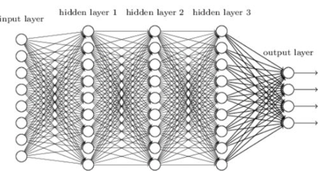


#### (4) **자연어처리 (NLP)**

- 인간의 **언어 형상**을 컴퓨터와 같은 기계를 이용해서 **모사**할 수 있도록 연구하고 이를 구현하는 인공지능의 주요 분야 중 하나

#### (5) 딥러닝 적용 사례

https://brunch.co.kr/@itschloe1/23


### 4. One-Hot-Encoding (1-of-Encoding)

- 결과가 0과 1이 아닌, 3가지 이상의 범주를 가질 때 
- 출력 노드를 범주 개수만큼, 그리고 각 자릿수마다 범주를 나타내도록 0과 1로 표현하는 방식

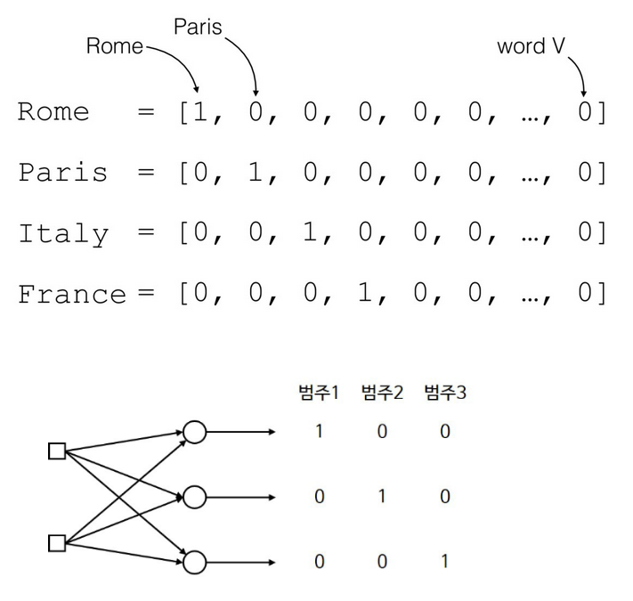


## 사전학습2 회귀 및 경사하강법

### 1. 회귀 

#### (1) 선형 회귀 (Linear Regression) 

- 종속 변수 y와 한개 이상의 독립 변수 x와의 **선형 상관** 관계를 모델링하는 회귀분석 기법

- 독립 변수 'x'를 사용하여 종속 변수 'y'의 움직임 예측 및 설명

- **1차원 방정식**을 찾는 과정

- **활성화 함수**는 주로 **계단 함수** 사용

  

#### (2) 로지스틱 회귀 (Logistic Regression)

- 선형회귀에서 구하는 **직선 대신 S자 곡선을** 이용하여 분류의 정확도를 향상한 회귀 방법

- 선형 회귀를 사용하여 데이터를 0과 1 사이의 값으로 분류하는 알고리즘

- 독립변수에 따른 종속변수를 추정하는데 사용되나, 종속변수가 **이진**인 형태

- **분류**에 이용

- **활성화 함수**는 주로 Sigmoid, ReLU, Softmax 함수 사용

  


### 2. 경사하강법 (Gradient Descent Algorithm) 

#### (1) 정의

- 손실 함수가 정의되었을 때, **손실 함수의 값이 최소**가 되는 지점
- **MSE(평균제곱오차/손실함수)**를 가중치(weight)에 대한 **미분 값이 감소**하는 방향으로 **가중치를 업데이트**하여 손실 함수의 최소값을 찾음

#### (2) 배치 (Batch)

- **Total Trainning Dataset**
- 단일 반복에서 기울기를 계산하는 데 사용하는 예의 총 개수
- **전체 데이터 셋에 대해 에러를 구한 뒤 기울기를 한번만 계산하여** 모델의 **파라미터를 업데이트** 하는 방식
- 배치가 너무 커지면 단일 반복으로 계산하는데 오랜 시간 걸림
- 유형
  - BGD
  - SGD
  - MSGD

#### (3) Batch Gradient Descent (BGD)

- 전체 데이터에 대해서 업데이트가 한번에 이루어지므로 **업데이트 횟수 자체는 적다**
- 한번의 업데이트에 모든 Trainning Data Set을 사용하므로 **계산 자체는 오래 걸린다**
- Error Gradient 계산하므로 **Optimal로 수렴이 안정적**
- **Local Optimal에 수렴**될 경우 탈출하기 어려울 수 있다
- GPU를 활용한 병렬처리에 유리
- 전체 학습데이터에 대해 한번에 처리를 해야하므로 **많은 메모리가** 필요

#### (4) Stochastic Gradient Descent (SGD) 

- 파라미터를 업데이트할 때 무작위로 샘플링된 학습 데이터를 하나씩만 사용하여 추출된 각각 **한개의 데이터**에 대해서 cost function(손실함수)의 Gradient 계산 후 업데이트 하는 알고리즘
- 확률적이기에 불안정하여 아래와 같이 **요동**치는 것을 볼 수 있으며 **자주 업데이트한다**
- 성능 개선 정도를 빠르게 확인
- 최소 cost에 수렴했는지의 판단이 상대적으로 어려움
- **Shooting**이 발생하므**로 Local Optimal 빠질 리스크가 다소 적어진다**
- 훈련 데이터 한개씩 처리하므로, GPU 성능에 대해서 **전부 활용이 불가하다**
- 때로는 **Global Optimal 찾지 못할 수도 있다**

#### (5) Mini-Batch Stochastic Gradient Descent (SGD, MSGD)

- **BGD와 SGD의 혼합**으로 SGD의 노이즈를 줄이면서 전체 배치보다 효율적이어서 **널리 사용**

- 전체 데이터셋에서 **m개의 데이터를 뽑아 mini-batch를 구성**

- 이것의 **평균 기울기를 통해 모델을 업데이트**

- BGD보다 (슈팅이 어느정도 발생하므로) **local optimal 빠질 리스크 적다**

- SGD보다는 GPU 성능을 활용한 **병렬처리가 가능하여 속도면에서 유리**

- 전체 데이터 아닌 일부 데이터만 메모리에 적재하여 사용하므로, 메모리 사용측면에서 BGD보다 원할

  [](https://t1.daumcdn.net/cfile/tistory/99AD3043601B4C5812?original)


## 사전학습3 신경망

### 1. 신경망 (**Neural Network**)

#### (1) 정의

> 신경망(Neural Network)는 사람의 두뇌 모양을 흉내내서 만든 모델

- 수많은 노드들과 각 노드들간의 **가중치**로 이루어져 있습니다
- 학습 데이터를 이용해 학습하면서 그 결과값에 따라 각 노드들간의 **가중치를 조금 변경**하며 학습

#### (2) 델타 규칙 

- **오차**가 크면 **가중치를 많이** 조절하고, **오차**가 작으면 **가중치를 적게** 조절
- Adaline, Widrow-Hoff 규칙이라고도 하며, 주어진 정보에 따라 단층 신경망의 가중치를 체계적으로 바꾸어주는 규칙
- 정답을 한 번에 바로 찾는게 아니라 **반복적인 학습 과정을 통해 정답**을 찾아가는 방식

#### (3) epoch 

- 학습 데이터를 한번씩 모두 학습시킨 **횟수**

#### (4) 오차 역전파 (Backpropagation) 

- 델타 학습법만으로는 신경망의 **모든 노드**들을 학습시킬 수 **없다**
- **은닉(Hidden) 계층**은 오차의 정의조차 되어 있지 않고, 정답 또한 정해져 있어서 학습 불가능
- 각 노드를 가중치에 대해 미분으로 계산하여 가중치를 업데이트 하는것은 무리가 있기 때문에
- **출력 노드만 가중치**에 대해 미분하고 그 값을 **이전 노드(역방향)**에 전달하여 재사용
- 출력층에서부터 시작해 **거꾸로 추적**해가며 오차에 따라 가중치를 조절하는 방법
- 순전파 이후에 출력값이 오류일 경우 출력층에서 입력층 방향으로(역방향) 가중치가 **더 이상 업데이트되지 않을때까지 반복**


### 2. 활성화 함수 (Activation Function) 

#### (1) 정의 

> 출력값을 활성화를 일으키게 할 것이냐를 결정하고, 그 값을 부여하는 함수

- **XOR 문제**를 다층 퍼셉트론으로 해결했지만, 은닉층만 늘린다고 선형분류기를 비선형분류기로 바꿀 수는 없음

- 선형 시스템의 경우 망이 아무리 깊어지더라도(은닉층의 수가 많아진다는 것), 1층의 은닉층으로 구현

- **선형인 멀티퍼셉트론**에서 **비선형 값을 얻기 위해** 사용하기 시작

- 이에 대한 해결책인 활성화 함수는 입력값에 대한 **출력값이 선형이 아니므로** 선형분류기를 **비선형분류기**로 만들 수 있음 (binary step, Sigmoid, ReLU, TanH 등)

  

#### (2) 경사각 소실 (Vanishing Gradient)

- 신경망의 계층을 깊게 할수록 성능이 더 떨어지는 원인 3개
  - **경사각 손실 (Vanishing Gradient)**
  - **과적합(Overfitting)**
  - 많은 계산량
- 활성화 함수(Activation Function)으로 많이 사용하는 **시그모이드(Sigmoid) 함수**는 최대 기울기가 `0.3`을 넘지 않습니다. 
- 곱하면 곱할수록 0에 가까워지고 결국 0이 되는 현상이 발생해서 **기울기가 사라집니다**
- 대안으로 시그모이드 함수대신 **ReLU** 함수를 사용해서 해결할 수 있습니다

#### (3) **시그모이드 함수 (Sigmoid)**

- Logistic 함수

- x 값이 작아질수록 0에 수렴하고, 커질수록 1에 수렴

- **경사각 소실 (Vanishing Gradient)**

   input값이 일정이상 올라가면 **미분값이 거의 0에 수렴**하게된다. 이는 |x||x|값이 커질 수록 Gradient Backpropagation시 미분값이 소실될 가능성이 크다


```python
def sigmoid(x):
    return 1/(1+np.exp(-x))

x = np.arange(-5,5,0.1)
# -5 ~ 5 범위에서 0.1 간격으로 값을 출력
y = sigmoid(x)
plt.plot(x,y)
plt.ylim(-0.1,1.0)
plt.show()
```

#### (4) **ReLU 함수 (Rectified Linear Unit)** 

- 최근 가장 많이 사용되는 활성화 함수
- sigmoid, tanh 함수와 비교시 학습이 훨씬 빨라진다
- 연산 비용이 크지않고, 구현이 매우 간단
- 입력이 특정값을 넘으면 입력이 그대로 출력되고, 0을 넘지 않을시 0을 반환하는 함수
- y = x (when x≥0), 0(when x<0)


```python
def ReLU(x):
    return np.maximum(0,x)
	# numpy 객체 np에 있는 maximum 메소드
	# np.maximum(0,x)는 0과 x 두 인자 가운데 큰것을 반환하는 메소드 함수

x = np.arange(-5, 5, 0.1)
y = ReLU(x)

plt.plot(x,ReLU(x))
plt.show()
```

#### (5) Step Function

- 계단모양 함수로, 특정값 이하는 0, 이상은 1로 출력하도록 만들어진 함수
- y = 1 (when x≥0), 0 (when x<0) 


```python
def step_function(x):
    return np.array(x>0.0, dtype = np.int)
	# 1번째 인자인 x>0.0은 x>0.0일 경우 True, 아닐경우 False를 반환
    # 2번째 인자인 dtype은 Data 타입을 어떤것으로 둘 것이냐 라는 함수인데 ,0과 1로 이루어진 함수이므로, int형을 선택

x = np.arange(-5, 5, 0.001)
# -5 ~ 5 범위에서 0.001 간격으로 값을 출력하고, 0을 기준으로 0과 1의 출력을 구분지어
y = step_function(x)
plt.plot(x,y)
plt.show()
```


### 3. 손실 함수 (Loss Function) 

#### (1) 정의

- **예측값과 정답** 사이의 **오차**를 정의하는 함수
- 머신러닝의 목적은 오차의 합을 **최소화**하여 **최적의 결과 값**을 도출하는 것 (잘 학습된 모델)
- **비용 함수 (cost function)** 또는 목적 함수 (object function) 
- 신경망을 학습할 때 정확도를 지표로 삼아서는 안된다. **정확도**를 지표로 하면 매개변수의 미분이 대부분의 장소에서 0이 되기 때문에 정확도는 매개변수의 미소한 변화에는 거의 반응을 보이지 않고, 반응이 있더라도 그 값이 불연속적으로 갑자기 변화한다. 이는 계단함수를 활성화 함수로 사용하지 않는 이유와도 같다
- 신경망 학습에서는 **최적의 매개변수 (가중치와 편향) 값**을 탐색할 때 **손실 함수**의 값을 가능한 작게 하는 매개변수 값을 찾는다. 이 때 매개변수의 미분을 계산하고, 그 미분 값을 단서로 매개변수의 값을 서서히 갱신하는과정을 반복

#### (2) 교차 엔트로피 오차(Cross Entropy Error, CEE)

- log는 밑이 e인 자연로그 이다. yk는 신경망의 출력, tk는 정답레이블


#### (3) **평균 제곱 오차 (Mean Squared Error**, MSE**)**

- 오차(예측값과 목표 값의 차이)를 제곱하여 더한 다음 그 수로 나눈 값

  

- **정답**에 가까울수록 **MSE 값이 작고**, 오답에 가까울수록 큰 값을 가짐

- 오차가 크면 클수록 MSE는 더 큰 값을 가지므로 **학습에 유리함**


### 4. 최적화 함수 (optimization)

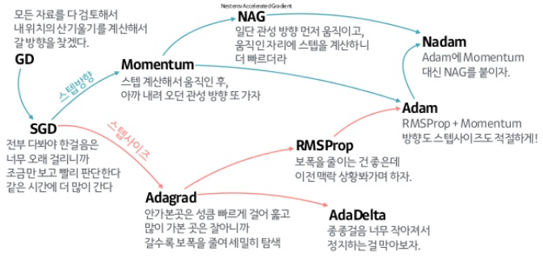

#### (1) 확률적 경사 하강법 Stochastic Gradient Descent (SGD)

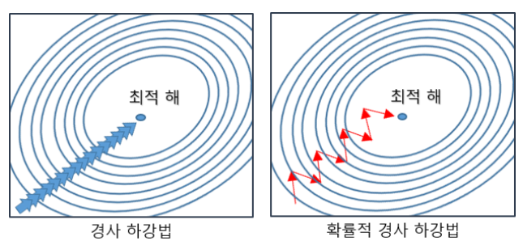

- 파라미터를 업데이트할 때 무작위로 샘플링된 학습 데이터를 하나씩만 사용하여 추출된 각각 **한개의 데이터**에 대해서 cost function(손실함수)의 Gradient 계산 후 업데이트 하는 알고리즘
- 확률적이기에 불안정하여 아래와 같이 **요동**치는 것을 볼 수 있으며 **자주 업데이트한다**
- 성능 개선 정도를 빠르게 확인
- 최소 cost에 수렴했는지의 판단이 상대적으로 어려움
- **Shooting**이 발생하므**로 Local Optimal 빠질 리스크가 다소 적어진다**
- 훈련 데이터 한개씩 처리하므로, GPU 성능에 대해서 **전부 활용이 불가하다**
- 때로는 **Global Optimal 찾지 못할 수도 있다**
- **속도는 개선**되었으나 **정확도가 낮다**

```python
weight[i] += - learning_rate * gradient
```


#### (2) 모멘텀(Momentum)

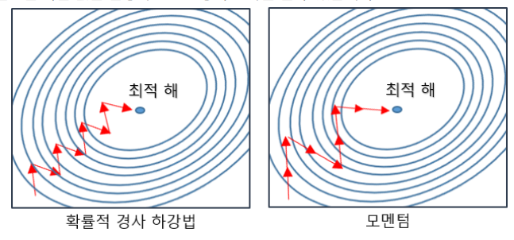

- 관성, 탄력, 가속도
-  경사 하강법과 마찬가지로 매번 기울기를 구하지만, 가중치를 수정하기전 이전 수정 방향(+,-)를 참고하여 같은 방향으로 일정한 비율만 수정
- 수정이 양(+) 방향, 음(-) 방향 순차적으로 일어나는 지그재그 현상이 줄어들고, 이전 이동 값을 고려해여 일정 비율만큼 다음 값을 결정하므로 관성의 효과
- av 값을 더해주며 a는 고정된 상수값이고(ex 0.9) v는 물체의 속도
- 해당 방향으로 진행할 수록 공이 기울기를 따라 구르듯 힘을 받는다
- 기존의 SGD를 이용할 경우 좌측의 local minima에 빠지면 gradient가 0이 되어 이동할 수가 없다
- momentum 방식의 경우 기존에 이동했던 방향에 관성이 있어 이 local minima를 빠져나오고 더 좋은 minima로 이동할 것을 기대할 수 있다

```python
# 파이썬 소스 코드
v = m * v - learning_rate * gradient
weight[i] += v
```

```python
# Tensorflow 소스 코드
optimize = tf.train.MomentumOptimizer(learning_rate=0.01,momentum=0.9).minimize(loss)
```


#### (3) AdaGrad

- 변수의 업데이트 횟수에 따라 학습률(Learning rate)를 조절하는 옵션이 추가된 최적화 방법
- 변수란 가중치(W) 벡터의 하나의 값(w[i])
- 학습률을 정하는 효과적 기술로 학습률 감소(learning rate decay)가 있다. 이는 학습을 진행하면서 학습률을 점차 줄여나가는 방법
-  가장 간단한 방법은 전체 학습률 값을 일괄적으로 낮추는 것이지만, 이를 더 발전시킨 것이 AdaGrad이다. AdaGrad는 ‘각각의’ 매개변수에 ‘맞춤형’값을 만들어준다

```python
# 파이썬 소스 코드
g += gradient**2
weight[i] += - learning_rate ( gradient / (np.sqrt(g) + e)
```

```python
# Tensorflow 소스 코드
optimizer = tf.train.AdagradOptimizer(learning_rate=0.01).minimize(loss)
```


#### (5) **RMSprop(알엠에스프롭)**

- 아다그라드의 G(t)의 값이 무한히 커지는 것을 방지하고자 제안된 방법
-  **지수 이동평균**을 이용한 방법

```python
# 파이썬 소스 코드
g = gamma * g + (1 - gamma) * gradient**2
weight[i] += -learning_rate * gradient / (np.sqrt(g) + e)
```

```python
# Tensorflow 소스 코드
optimize = tf.train.RMSPropOptimizer(learning_rate=0.01,decay=0.9,momentum=0.0,epsilon=1e-10).minimize(cost)
```


#### (6) Adam

- Momentum + RMSprop
- RMSprop의 특징인 gradient의 제곱을 지수평균한 값을 사용하며 Momentum의 특징으로 gradient를 제곱하지 않은 값을 사용하여 지수평균을 구하고 수식에 활용

```python
# Tensorflow 소스 코드
optimizer = tf.train.AdamOptimizer(learning_rate=0.001,beta1=0.9,beta2=0.999,epsilon=1e-08 ).minimize(loss)
```


#### (7) **AdaDelta**

- Adagrad + RMSprop + Momentum 모두를 합친 경사하강법

```python
# Tensorflow 소스 코드
optimizer = tf.train.adadeltaoptimizer(learning_rate=0.001, rho=0.95, epsilon=1e-08).minimize(loss)
```


#### (8) **Nesterov Accelrated Gradient(NAG, **네스테로프 모멘텀)

- momentum값과 gradient값이 더해저 실제(actual)값을 만드는 기존 모멘텀과 차별
- momentum값이 적용된 지점에서 gradient값이 계산

```python
# 파이썬 소스 코드
v = m * v - learning_rate * gradient(weight[i-1]+m*v)
weight[i] += v
```

```python
# Tensorflow 소스 코드
optimize = tf.train.MomentumOptimizer(learning_rate=0.01,momentum=0.9,use_nesterov=True).minimize(loss)
```


## 사전학습4 파이썬 라이브러리

### 1. Numpy

#### (1) 정의

-  벡터, 행렬 등 수치 연산을 수행하는 선형대수(Linear algebra) 라이브러리 
-  선형대수 관련 수치 연산을 지원하고 내부적으로는 C로 구현되어 있어 연산이 빠른 속도로 수행
- Scientific Computing 을 파이썬에서 가능하게 하기 위해 만들어진 Python 패키지
- 머신 러닝 계산의 기반이 되는 N-Dimensional Array 계산을 쉽고 빠르게 가능하게 하며, Linear Algebra, Fourier Transform, Random Number Capabilities 에 대한 함수를 제공

#### (2) install 

```bash
pip install numpy
```

#### (3) import

```python
import numpy as np
import numpy.random as npr
```

#### (4) ndarray

- 배열  :`ndarray`
  - 동차(Homogeneous) 다차원 배열
  - Numpy.array와 Python.array는 다릅니다

- 차원 : `dimension `

  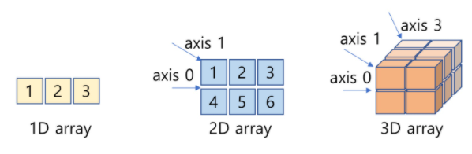

  ```python
  a = np.arange(6) # 1D
  print(a)
  # [0 1 2 3 4 5]
  
  b = np.arange(12).reshape(4,3) # 2D
  print(b)
  # [[ 0  1  2]
  #  [ 3  4  5]
  #  [ 6  7  8]
  #  [ 9 10 11]]
  
  c = np.arange(24).reshape(2,3,4) # 3D 배열은 2차원이 N개 출력되는 형식
  print(c)
  # [[[ 0  1  2  3]
  #   [ 4  5  6  7]
  #   [ 8  9 10 11]]
  #
  #  [[12 13 14 15]
  #   [16 17 18 19]
  #   [20 21 22 23]]]
  ```


- 축 : `axis`

  ```python
  #1 1개의 축
  [1, 2, 1] # 요소(Element) = 길이(Length) = 3
  
  #2 2개의 축
  [[ 1, 0, 0], # 1번째 축(행/x축/가로축)은 길이(개수)가 2
   [ 0, 1, 2]] # 2번째 축(열/y축/세로축)은 길이(개수)가 3
  ```

- 출력 : `pprint`

  ```python
  def pprint(arr):
      print("type:{}".format(type(arr)))
      print("shape: {}, dimension: {}, dtype:{}".format(arr.shape, arr.ndim, arr.dtype))
      print("Array's Data:\n", arr)
  
  arr = np.array([[[1,2,3], [4,5,6]], [[3,2,1], [4,5,6]]], dtype = float)
  a= np.array(arr, dtype = float)
  
  pprint(a)
  
  '''
  type:<class 'numpy.ndarray'>
  shape: (2, 2, 3), dimension: 3, dtype:float64
  Array's Data:
  [[[ 1.  2.  3.]
  [ 4.  5.  6.]]
  
  [[ 3.  2.  1.]
  [ 4.  5.  6.]]]
  '''
  ```

#### (5) 배열 생성

- **np.array()** : 배열 생성 (반드시 `[]` 연속된 배열로 입력)

  ```python
  a = np.array([2,3,4])
  print(a) # [2 3 4]
  print(a.dtype) # int64
  
  b = np.array([1.2, 3.5, 5.1])
  print(b.dtype) # float64
  
  c = np.array( [ [1,2], [3,4] ], dtype = complex) # 복소수
  print(c)
  # [[1.+0.j 2.+0.j]
  #  [3.+0.j 4.+0.j]]
  
  a = np.array([1,2,3,4])  # RIGHT
  print(a)
  
  a = np.array(1,2,3,4)    # WRONG
  print(a)
  # ValueError: only 2 non-keyword arguments accepted
  ```


- np.zeros(shape) : 0으로 구성된 N차원 배열 생성

- np.ones(shape) : 1로 구성된 N차원 배열 생성

- np.eye(N) : (N, N) shape 단위 행렬 생성

- np.empty(shape) : 초기화되지 않은 N차원 배열 생성

- np.full(shape, , fill_value) : fill_value로 구성된 N차원 배열 생성

  - 

  ```python
  #[3,4] 크기의 배열을 생성하여 0으로 채움
  print(np.zeros((3,4)))
  # [[0. 0. 0. 0.]
  #  [0. 0. 0. 0.]
  #  [0. 0. 0. 0.]]
  
  # [2,3,4] 크기의 배열을 생성하여 1로 채움
  print(np.ones((2,3,4), dtype=np.int16))
  # [[[1 1 1 1]
  #   [1 1 1 1]
  #   [1 1 1 1]]
  
  #  [[1 1 1 1]
  #   [1 1 1 1]
  #   [1 1 1 1]]]
  
  # [2,2] 크기의 배열을 생성하여 7으로 채움
  print(np.full((2,2),7))
  # [[7 7]
  # [7 7]]
  
  np.eye(4)
  '''
  array([[ 1.,  0.,  0.,  0.],
       [ 0.,  1.,  0.,  0.],
       [ 0.,  0.,  1.,  0.],
       [ 0.,  0.,  0.,  1.]])
  '''
  ```


- np.arange() : N 만큼 차이나는 숫자 생성

- np.linspace() : N 등분한 숫자 생성

- np.logspace() : 로그 스케일로 지정된 범위에서 num개수만큼 균등 간격 숫자 생성

  ```python
  # 10이상 30미만 까지 5씩 차이나게 생성
  print(np.arange(10, 30, 5, np.float))
  # [10. 15. 20. 25.]
  
  # 0이상 2미만 까지 0.3씩 차이나게 생성
  print(np.arange(0, 2, 0.3))
  # [0.  0.3 0.6 0.9 1.2 1.5 1.8]
  
  # 0~99까지 100등분(100개)
  x = np.linspace(0, 99, 100)
  print(x)
  # [ 0.  1.  2.  3. ... 98. 99.]
  
  # linspace의 데이터 추출 시각화
  import matplotlib.pyplot as plt
  plt.plot(x, 'o')
  plt.show()
  ```


#### (7) 배열 속성

- **np.ndarray.reshape()** : 데이터는 그대로 유지한 채 **차원을 쉽게 변경**

- **ndarray.shape** : 배열의 각 **축(axis)의 크기**

- ndarray.ndim : 축의 개수(Dimension)

- ndarray.dtype : 각 요소(Element)의 타입

- ndarray.itemsize : 각 요소(Element)의 타입의 bytes 크기

- **ndarray.size** : 전체 **요소(Element)의 개수**

  ```python
  #  (3, 5) 크기의 2D 배열을 생성
  a = np.arange(15).reshape(3, 5)
  
  print(a)
  # [[ 0  1  2  3  4]
  #  [ 5  6  7  8  9]
  #  [10 11 12 13 14]]
  
  print(a.shape) # 각 축의 크기 (행/x축/가로축, 열/y축/세로축)
  # (3, 5)
  
  print(a.ndim) # 축의 개수 (배열의 차원 수)
  # 2
  
  print(a.dtype) # 각 요소(Element)의 타입
  # int64
  
  print(a.itemsize) # 각 요소(Element)의 타입의 bytes 크기
  # 8
  
  print(a.size) # 전체 요소의 개수 np.arange(15)
  # 15
  
  print(a.dtype.name) # 배열 타입명 
  
  print(type(a))
  # <class 'numpy.ndarray'>
  ```


#### (8) 연산 

- element wise 연산 : 숫자가 각각의 요소에 연산이 적용

  ```python
  a = np.array( [20,30,40,50] )
  b = np.arange( 4 )
  print(b)
  # [0 1 2 3]
  
  # a에서 b에 각각의 원소를 -연산
  c = a-b
  print(c)
  # [20 29 38 47]
  
  # b 각각의 원소에 제곱 연산
  print(b**2)
  # [0 1 4 9]
  
  # a 각각의 원소에 *10 연산
  print(10*np.sin(a))
  # [ 9.12945251 -9.88031624  7.4511316  -2.62374854]
  
  # a 각각의 원소가 35보다 작은지 Boolean 결과
  print(a<35)
  # [ True  True False False]
  ```


- 행렬 연산

  - `*` : 각각의 원소끼리 곱셈 (Elementwise product, Hadamard product)
  - `@` : 행렬 곱셈 (Matrix product)
  - `.dot()` : 행렬 내적 (dot product)

  ```python
  A = np.array( [[1,1],
                 [0,1]] )
  B = np.array( [[2,0],
                 [3,4]] )
  print(A * B) # * 각각의 원소 곱셈 (Elementwise product, Hadamard product)
  # [[2 0]
  #  [0 4]]
  
  print(A @ B) # @ 행렬 곱셈 (Matrix product)
  # [[5 4]
  #  [3 4]]
  
  print(A.dot(B)) # .dot() 행렬 내적 (dot product)
  # [[5 4]
  #  [3 4]]
  ```

- 최대 및 최소 : **axis 값을 입력**하면 축을 기준으로도 연산 가능

  - `.sum()`: 모든 요소의 합
  - `.min()`: 모든 요소 중 최소값
  - `.max()`: 모든 요소 중 최대값
  - `.argmax()`: 모든 요소 중 최대값의 인덱스
  - `.cumsum()`: 모든 요소의 누적합

  ```python
  a = np.arange(8).reshape(2, 4)**2
  print(a)
  # [[ 0  1  4  9]
  #  [16 25 36 49]]
  
  # 모든 요소의 합
  print(a.sum()) # 140
  
  # 모든 요소 중 최소값
  print(a.min()) # 0
  
  # 모든 요소 중 최대값
  print(a.max()) # 49
  
  # 모든 요소 중 최대값의 인덱스
  print(a.argmax()) # 7
  
  # 모든 요소의 누적합
  print(a.cumsum()) # [  0   1   5  14  30  55  91 140]
  
  b = np.arange(12).reshape(3,4)
  print(b)
  # [[ 0  1  2  3]
  #  [ 4  5  6  7]
  #  [ 8  9 10 11]]
  
  print(b.sum(axis=0))
  # [12 15 18 21]
  
  print(b.sum(axis=1))
  # [ 6 22 38]
  ```


#### (9) 인덱싱 및 슬라이싱 

- np.fromfunction() : 인덱스 번호를 가지고 함수를 정의해 생성

  ```python
  def f(x,y):
      return 10*x+y
  
  b = np.fromfunction(f, (5,4), dtype=int)
  print(b)
  # [[ 0  1  2  3]
  #  [10 11 12 13]
  #  [20 21 22 23]
  #  [30 31 32 33]
  #  [40 41 42 43]]
  
  print(b[2,3])
  # 23
  
  print(b[0:5, 1])
  # [ 1 11 21 31 41]
  
  print(b[ : ,1])
  # [ 1 11 21 31 41]
  
  print(b[1:3, : ])
  # [[10 11 12 13]
  #  [20 21 22 23]]
  
  print(b[-1])
  # [40 41 42 43]
  ```


#### (10) 난수 생성

- np.random.normal : 정규 분포 확률 밀도에서 표본 추출

  - normal(loc=0.0, scale=1.0, size=None)
  - loc: 정규 분포의 평균
  - scale: 표준편차

  ![img](data:image/png;base64,iVBORw0KGgoAAAANSUhEUgAAAXoAAAD8CAYAAAB5Pm/hAAAABHNCSVQICAgIfAhkiAAAAAlwSFlz%0AAAALEgAACxIB0t1+/AAAADl0RVh0U29mdHdhcmUAbWF0cGxvdGxpYiB2ZXJzaW9uIDIuMS4wLCBo%0AdHRwOi8vbWF0cGxvdGxpYi5vcmcvpW3flQAAEhZJREFUeJzt3X+s3XV9x/Hna4yBUTd0XFlty0q2%0AToNOi7lDjEvmYGpFY3FRgtkQlaUugUQTMwVNpsaRsDhlLttYqjDrxkTij9AgThFJiMkECxYEClun%0AMNpUWhUQQ8YCvvfH+RaPeNtz7j3n9Jz7uc9HcnK/38/3+z3nXeh93c/9fD/fT1NVSJLa9UvTLkCS%0ANFkGvSQ1zqCXpMYZ9JLUOINekhpn0EtS4wx6SWqcQS9JjTPoJalxvzztAgCOPfbYWrdu3bTLkKRl%0A5ZZbbvlBVc0NOm9g0Cc5GrgROKo7/3NV9YEknwL+AHi4O/WtVbUjSYCPA6cDj3bttx7qM9atW8f2%0A7dsHlSJJ6pPkvmHOG6ZH/xhwalX9JMmRwDeSfLk79hdV9bmnnP8aYH33eilwafdVkjQFA8foq+cn%0A3e6R3etQK6FtAj7dXfdN4Jgkq0YvVZK0FEPdjE1yRJIdwD7guqq6qTt0UZLbk1yS5KiubTVwf9/l%0Au7s2SdIUDBX0VfVEVW0A1gAnJ3khcCHwfOD3gGcD713MByfZnGR7ku379+9fZNmSpGEtanplVT0E%0A3ABsrKq93fDMY8A/Ayd3p+0B1vZdtqZre+p7bamq+aqan5sbeNNYkrREA4M+yVySY7rtpwGvBO4+%0AMO7ezbI5A7iju2Qb8Jb0nAI8XFV7J1K9JGmgYWbdrAK2JjmC3g+Gq6rqmiRfTzIHBNgB/Hl3/rX0%0Aplbuoje98m3jL1uSNKyBQV9VtwMnLdB+6kHOL+C80UuTJI2DSyBIUuNmYgkEqSXrLvjSk9v3Xvza%0AKVYi9Rj00hIZ6FouHLqRpMYZ9JLUOINekhrnGL00Bv3j9dKsMeilAUa56eoNW80Cg17q2CtXqxyj%0Al6TGGfSS1DiDXpIaZ9BLUuO8GSsdJs7A0bTYo5ekxtmjl6bA3r0OJ3v0ktQ4g16SGufQjbQIPj2r%0A5cgevSQ1zqCXpMYNDPokRye5OcltSe5M8qGu/YQkNyXZleSzSX6laz+q29/VHV832T+CJOlQhunR%0APwacWlUvBjYAG5OcAvw1cElV/TbwIHBud/65wINd+yXdeZKkKRkY9NXzk273yO5VwKnA57r2rcAZ%0A3fambp/u+GlJMraKpcasu+BLT76kSRhqjD7JEUl2APuA64D/Bh6qqse7U3YDq7vt1cD9AN3xh4Ff%0AH2fRkqThDRX0VfVEVW0A1gAnA88f9YOTbE6yPcn2/fv3j/p2kqSDWNSsm6p6CLgBeBlwTJID8/DX%0AAHu67T3AWoDu+K8BP1zgvbZU1XxVzc/NzS2xfEnSIMPMuplLcky3/TTglcBOeoH/xu60c4Cru+1t%0A3T7d8a9XVY2zaEnS8IZ5MnYVsDXJEfR+MFxVVdckuQu4MslfAd8GLuvOvwz4lyS7gB8BZ02gbknS%0AkAYGfVXdDpy0QPt36Y3XP7X9f4E3jaU6SdLIfDJWkhrnomZq3sHmp7sOvFYKe/SS1DiDXpIaZ9BL%0AUuMMeklqnDdjtWK5iJhWCnv0ktQ4g16SGmfQS1LjDHpJapw3Y9Ukb7RKP2OPXpIaZ9BLUuMMeklq%0AnEEvSY0z6CWpcQa9JDXOoJekxhn0ktQ4g16SGmfQS1LjBgZ9krVJbkhyV5I7k7yza/9gkj1JdnSv%0A0/uuuTDJriT3JHn1JP8AkqRDG2atm8eBd1fVrUmeCdyS5Lru2CVV9Tf9Jyc5ETgLeAHwXOBrSX6n%0Aqp4YZ+GSpOEM7NFX1d6qurXbfgTYCaw+xCWbgCur6rGq+h6wCzh5HMVKkhZvUWP0SdYBJwE3dU3n%0AJ7k9yeVJntW1rQbu77tsN4f+wSBJmqChlylO8gzg88C7qurHSS4FPgxU9/WjwNsX8X6bgc0Axx9/%0A/GJqlhbk0sTSwoYK+iRH0gv5K6rqCwBV9UDf8U8A13S7e4C1fZev6dp+TlVtAbYAzM/P11KKl1rW%0A/4Pr3otfO8VKtNwNM+smwGXAzqr6WF/7qr7T3gDc0W1vA85KclSSE4D1wM3jK1mStBjD9OhfDpwN%0AfCfJjq7tfcCbk2ygN3RzL/AOgKq6M8lVwF30Zuyc54wbSZqegUFfVd8AssChaw9xzUXARSPUJa1I%0A3mfQJPhkrCQ1zqCXpMYZ9JLUOINekhpn0EtS4wx6SWqcQS9JjTPoJalxBr0kNW7o1SulWeSTpNJg%0A9uglqXEGvSQ1zqEbaRlwbXqNwh69JDXOoJekxhn0ktQ4g16SGmfQS1LjnHUjLTPOwNFiGfRadnwa%0AVlocg17LguEuLd3AMfoka5PckOSuJHcmeWfX/uwk1yX5r+7rs7r2JPm7JLuS3J7kJZP+Q0iSDm6Y%0Am7GPA++uqhOBU4DzkpwIXABcX1Xrgeu7fYDXAOu712bg0rFXLUka2sCgr6q9VXVrt/0IsBNYDWwC%0AtnanbQXO6LY3AZ+unm8CxyRZNfbKJUlDWdQYfZJ1wEnATcBxVbW3O/R94LhuezVwf99lu7u2vUga%0AK2fgaBhDB32SZwCfB95VVT9O8uSxqqoktZgPTrKZ3tAOxx9//GIu1QrhDVhpPIZ6YCrJkfRC/oqq%0A+kLX/MCBIZnu676ufQ+wtu/yNV3bz6mqLVU1X1Xzc3NzS61fkjTAMLNuAlwG7Kyqj/Ud2gac022f%0AA1zd1/6WbvbNKcDDfUM8kqTDbJihm5cDZwPfSbKja3sfcDFwVZJzgfuAM7tj1wKnA7uAR4G3jbVi%0ASdKiDAz6qvoGkIMcPm2B8ws4b8S6JElj4qJmktQ4g16SGudaN1IjnFOvgzHopQYZ+urn0I0kNc6g%0Al6TGGfSS1DjH6DVTXN9GGj+DXlNnuEuT5dCNJDXOoJekxhn0ktQ4g16SGmfQS1LjDHpJapxBL0mN%0AM+glqXEGvSQ1zqCXpMYZ9JLUONe6kRrnP0Iig15T4UJm0uEzcOgmyeVJ9iW5o6/tg0n2JNnRvU7v%0AO3Zhkl1J7kny6kkVLkkazjBj9J8CNi7QfklVbehe1wIkORE4C3hBd80/JjliXMVKkhZvYNBX1Y3A%0Aj4Z8v03AlVX1WFV9D9gFnDxCfZKkEY0y6+b8JLd3QzvP6tpWA/f3nbO7a/sFSTYn2Z5k+/79+0co%0AQ5J0KEsN+kuB3wI2AHuBjy72DapqS1XNV9X83NzcEsuQJA2ypKCvqgeq6omq+inwCX42PLMHWNt3%0A6pquTZI0JUsK+iSr+nbfAByYkbMNOCvJUUlOANYDN49WoiRpFAPn0Sf5DPAK4Ngku4EPAK9IsgEo%0A4F7gHQBVdWeSq4C7gMeB86rqicmULkkaxsCgr6o3L9B82SHOvwi4aJSiJEnj41o3ktQ4g16SGmfQ%0AS1LjXNRMWkFcyXJlskcvSY0z6CWpcQa9JDXOoJekxnkzVpI3aRtnj16SGmePXhNlT1GaPnv0ktQ4%0Ag16SGufQjbRC9Q+rqW326CWpcQa9JDXOoJekxhn0ktQ4g16SGmfQS1LjnF6pw8bpfNJ0DAz6JJcD%0ArwP2VdULu7ZnA58F1gH3AmdW1YNJAnwcOB14FHhrVd06mdI1qwx0abYMM3TzKWDjU9ouAK6vqvXA%0A9d0+wGuA9d1rM3DpeMqUJC3VwKCvqhuBHz2leROwtdveCpzR1/7p6vkmcEySVeMqVpK0eEu9GXtc%0AVe3ttr8PHNdtrwbu7ztvd9cmSZqSkWfdVFUBtdjrkmxOsj3J9v37949ahiTpIJYa9A8cGJLpvu7r%0A2vcAa/vOW9O1/YKq2lJV81U1Pzc3t8QyJEmDLHV65TbgHODi7uvVfe3nJ7kSeCnwcN8Qj6Rl4Kmz%0ApvwHY5a/YaZXfgZ4BXBskt3AB+gF/FVJzgXuA87sTr+W3tTKXfSmV75tAjVLkhZhYNBX1ZsPcui0%0ABc4t4LxRi9Ly49x5aXa5BIIkNc6gl6TGGfSS1DiDXpIaZ9BLUuMMeklqnOvRa1H6p1H6II20PBj0%0Akg7JH+7Ln0M3ktQ4g16SGmfQS1LjDHpJapw3Y7VkLmQmLQ8GvaShHeyHu7NxZptDN5LUOINekhrn%0A0I0GcixeWt4Meklj5ZO0s8ehG0lqnD16LcjhGqkd9uglqXEGvSQ1bqShmyT3Ao8ATwCPV9V8kmcD%0AnwXWAfcCZ1bVg6OVKUlaqnGM0f9hVf2gb/8C4PqqujjJBd3+e8fwOZJmlPd0Ztskhm42AVu77a3A%0AGRP4DEnSkEYN+gK+muSWJJu7tuOqam+3/X3guIUuTLI5yfYk2/fv3z9iGZKkgxl16Ob3q2pPkucA%0A1yW5u/9gVVWSWujCqtoCbAGYn59f8BxJ0uhGCvqq2tN93Zfki8DJwANJVlXV3iSrgH1jqFPSMuRT%0AsrNhyUM3SZ6e5JkHtoFXAXcA24BzutPOAa4etUhJ0tKN0qM/DvhikgPv829V9e9JvgVcleRc4D7g%0AzNHLlCQt1ZKDvqq+C7x4gfYfAqeNUpQkaXx8MlaSGmfQS1LjXL1S0mHhDJzpsUcvSY0z6CWpcQ7d%0A6EkuTKXDxWGcw8ugX+EMd6l9Bv0KZLhrlti7nzzH6CWpcQa9JDXOoRtJM8khnfEx6FcAx+S13Bn6%0Ao3HoRpIaZ49+mTtYT8devKQD7NFLUuPs0UuaGf4mOhkGfUP8JpG0EIN+mTDEJS2VY/SS1DiDXpIa%0A59CNpGVrmCFNH7CaYNAn2Qh8HDgC+GRVXTypz2qJTwBKh+b9qsWbSNAnOQL4B+CVwG7gW0m2VdVd%0Ak/i8WTPMQ0zDPNzkX2hpvA72PdV6p2pSPfqTgV1V9V2AJFcCm4AVEfT9DHFJ0zapoF8N3N+3vxt4%0A6SQ+aNShjnH1vlvvEUjL1TCdqqV0vEb5nj/cQ7SpqvG/afJGYGNV/Vm3fzbw0qo6v++czcDmbvd5%0AwD1jL+TnHQv8YMKfsVjWNJxZrAlmsy5rGs4s1gSLr+s3q2pu0EmT6tHvAdb27a/p2p5UVVuALRP6%0A/F+QZHtVzR+uzxuGNQ1nFmuC2azLmoYzizXB5Oqa1Dz6bwHrk5yQ5FeAs4BtE/osSdIhTKRHX1WP%0AJzkf+Aq96ZWXV9Wdk/gsSdKhTWwefVVdC1w7qfdfgsM2TLQI1jScWawJZrMuaxrOLNYEE6prIjdj%0AJUmzw7VuJKlxKzLok7w7SSU5dgZq+XCS25PsSPLVJM+dgZo+kuTurq4vJjlmBmp6U5I7k/w0yVRn%0ASyTZmOSeJLuSXDDNWg5IcnmSfUnumHYtByRZm+SGJHd1/+/eOQM1HZ3k5iS3dTV9aNo1HZDkiCTf%0ATnLNuN97xQV9krXAq4D/mXYtnY9U1YuqagNwDfCX0y4IuA54YVW9CPhP4MIp1wNwB/DHwI3TLKJv%0AeY/XACcCb05y4jRr6nwK2DjtIp7iceDdVXUicApw3gz8t3oMOLWqXgxsADYmOWXKNR3wTmDnJN54%0AxQU9cAnwHmAmbk5U1Y/7dp/ODNRVVV+tqse73W/Sew5iqqpqZ1VN+qG6YTy5vEdV/R9wYHmPqaqq%0AG4EfTbuOflW1t6pu7bYfoRdiq6dcU1XVT7rdI7vX1L/nkqwBXgt8chLvv6KCPskmYE9V3TbtWvol%0AuSjJ/cCfMBs9+n5vB7487SJmyELLe0w1vJaDJOuAk4CbplvJk0MkO4B9wHVVNfWagL+l1wH96STe%0AvLn16JN8DfiNBQ69H3gfvWGbw+pQNVXV1VX1fuD9SS4Ezgc+MO2aunPeT+/X7ysmXc+wNWn5SfIM%0A4PPAu57yG+xUVNUTwIbu3tMXk7ywqqZ2byPJ64B9VXVLkldM4jOaC/qq+qOF2pP8LnACcFsS6A1H%0A3Jrk5Kr6/jRqWsAV9J49mHjQD6opyVuB1wGn1WGag7uI/07TNHB5D/1MkiPphfwVVfWFadfTr6oe%0ASnIDvXsb07yJ/XLg9UlOB44GfjXJv1bVn47rA1bM0E1VfaeqnlNV66pqHb1fuV8y6ZAfJMn6vt1N%0AwN3TquWA7h+NeQ/w+qp6dNr1zBiX9xhSej2qy4CdVfWxadcDkGTuwCyyJE+j929mTPV7rqourKo1%0AXS6dBXx9nCEPKyjoZ9jFSe5Icju9YaWpT0ED/h54JnBdN+3zn6ZdUJI3JNkNvAz4UpKvTKOO7ib1%0AgeU9dgJXzcLyHkk+A/wH8Lwku5OcO+2a6PVUzwZO7f4e7eh6rdO0Crih+377Fr0x+rFPZ5w1Phkr%0ASY2zRy9JjTPoJalxBr0kNc6gl6TGGfSS1DiDXpIaZ9BLUuMMeklq3P8DzF1VdjcLu9kAAAAASUVO%0ARK5CYII=)

  ```python
  # 표본 10000개의 배열을 100개 구간(bins)으로 구분할 때, 정규 분포 형태
  data = np.random.normal(0, 1, 10000)
  import matplotlib.pyplot as plt
  plt.hist(data, bins=100)
  plt.show()
  ```

- np.random.rand : 균등 분포

- np.random.randn : 표준 정규 분포

- np.random.randint : 지정된 shape를 배열로 만들고 low부터 high 미만 범위에서 정수 표본 추출 (균등 분포)

  ```python
  np.random.randint(0, 10, (2, 3))
  # array([[0, 1, 7],
  #      [0, 2, 3]])
  ```

- np.random.random : 균등 분포

  ```python
  np.random.random((2, 2))
  # array([[ 0.4573231 ,  0.1649216 ],
  #      [ 0.76895461,  0.96333133]])
  ```

#### (11) 브로드캐스팅

- 단순하게 편리성을 위해 **Shape가 다른** np.narray 끼리 연산을 지원
- 차원(ndim)이 같고 각 축(axis)의 값이 같거나 1이야 연산이 가능
- **각 축의 값이 다르면** 브로드캐스팅되어 값이 복사


```python
np.array([1,2,3,4,5]) * 2 

np.array([1,2,3,4,5]) * np.array([2,2,2,2,2])
# Numpy List : Broadcasting
# [2,4,6,8,10]

# Python List : 값이 10개인 배열이 생성
# [1,2,3,4,5,1,2,3,4,5]
```


### 2. Matplotlib

#### (1) 정의 

- 다양한 형태의 그래프를 Matplotlib 을 사용하여 손쉽게 그리며 **데이터 시각화**를 위해 사용되는 파이썬 라이브러리
- 통계 기능과 색 테마를 지원하는 **Seaborn 라이브러리**를 함께 활용하면 더욱 간편하게 그래프 표현 가능

#### (2) install

```python
python -m pip install -U pip
python -m pip install -U matplotlib
```

#### (3) import

```python
import matplotlib.pyplot as plt
import numpy as np
```

#### (4) pyplot

- 그래프 `plt`

  ```python
  import matplotlib.pyplot as plt
  
  plt.plot([1, 2, 3, 4], [1, 4, 9, 16])
  plt.show()
  ```

  

- 복수 그래프 `plt`

  ```python
  import matplotlib.pyplot as plt
  import numpy as np
  
  # 200ms 간격으로 균일하게 샘플된 시간
  t = np.arange(0., 5., 0.2)
  
  # 빨간 대쉬(r--), 파란 사각형(bs), 녹색 삼각형(g^)
  plt.plot(t, t, 'r--', t, t**2, 'bs', t, t**3, 'g^')
  plt.show()
  ```

  

#### (5) input

- **y값 입력**

  ```python
  import matplotlib.pyplot as plt
  
  plt.plot([2, 3, 5, 10])
  #1 리스트 형태로 값들을 입력하면 y 값으로 인식하며 x 값은 기본적으로 [0, 1, 2, 3]
  #2 파이썬 튜플 plot((2, 3, 5, 10)) 
  #3 Numpy 어레이 plot(np.array([2, 3, 5, 10])
  plt.show()
  ```

- **x값 및 y값 입력**

  ```python
  import matplotlib.pyplot as plt
  
  plt.plot([1, 2, 3, 4], [2, 3, 5, 10])
  # plt.plot([x_value_list], [y_value_list)
  # 점 (1, 2), (2, 3), (3, 5), (4, 10)를 잇는 꺾은선 그래프
  plt.show()
  ```

- dictionary값 입력

  ```python
  import matplotlib.pyplot as plt
  
  data_dict = {'data_x': [1, 2, 3, 4, 5], 'data_y': [2, 3, 5, 10, 8]}
  
  plt.plot('data_x', 'data_y', data=data_dict)
  plt.show()
  ```

#### (6) axis

- **축 라벨 함수**

  - plt.xlabel()
  - plt.ylabel()

  ```python
  import matplotlib.pyplot as plt
  
  plt.plot([1, 2, 3, 4], [1, 4, 9, 16])
  plt.xlabel('X-Label')
  plt.ylabel('Y-Label')
  plt.show()
  ```

- **축 라벨 함수 파라미터**

  - 여백 : labelpad
  - 폰트:  fontdict
  - 위치 : loc
    - xlabel() : ‘left’, ‘center’, ‘right’
    - ylabel() : ‘bottom’, ‘center’, ‘top’

  ```python
  import matplotlib.pyplot as plt
  
  font1 = {'family': 'serif',
           'color': 'b',
           'weight': 'bold',
           'size': 14
           }
  
  font2 = {'family': 'fantasy',
           'color': 'deeppink',
           'weight': 'normal',
           'size': 'xx-large'
           }
  
  plt.plot([1, 2, 3, 4], [2, 3, 5, 10])
  plt.xlabel('X-Axis', labelpad=15, fontdict=font1, loc='right')
  plt.ylabel('Y-Axis', labelpad=20, fontdict=font2, loc='top')
  # X축 레이블에 대해서 15pt, Y축 레이블에 대해서 20pt 만큼의 여백
  # xlabel() 함수의 loc 파라미터는 X축 레이블의 위치를 지정합니다. ({‘left’, ‘center’, ‘right’})
  # ylabel() 함수의 loc 파라미터는 Y축 레이블의 위치를 지정합니다. ({‘bottom’, ‘center’, ‘top’})
  plt.show()
  ```

- **축 스케일 함수**

  - plt.xscale()

    - symlog : 양, 음의 방향이 대칭적인 로그 스케일

      ```python
      import matplotlib.pyplot as plt
      import numpy as np
      
      x = np.linspace(-10, 10, 100)
      y = x ** 3
      
      plt.plot(x, y)
      plt.xscale('symlog')
      # Symmetrical Log Scale
      # 양, 음의 방향이 대칭적인 로그 스케일
      
      plt.show()
      ```

      

  - plt.yscale()

    - linear 

      ```python
      import matplotlib.pyplot as plt
      import numpy as np
      
      x = np.linspace(0, 5, 100)
      y = np.exp(x) # 지수함수 (Exponential function)
      
      plt.plot(x, y)
      plt.yscale('linear')
      plt.show()
      ```

      

    - log  : 로그 스케일은 지수함수 (Exponential function)와 같이 기하급수적으로 변화하는 데이터

      ```python
      plt.yscale('log')
      ```

      

- **축 범위 함수**

  - plt.xlim([xmin, xmax]) 
  - plt.ylim([ymin, ymax]) 
  - plt.axis([xmin, xmax, ymin, ymax])

  ```python
  plt.xlim([0, 5])      # X축의 범위: [xmin, xmax]
  plt.ylim([0, 20])     # Y축의 범위: [ymin, ymax]
  plt.axis([0, 5, 0, 20])  # X, Y축의 범위: [xmin, xmax, ymin, ymax]
  ```

- 축 함수에 따른 그래프 모양

  - 'on' | 'off' | 'equal' | 'scaled' | 'tight' | 'auto' | 'normal' | 'image' | 'square'

  ```python
  plt.axis('square') # 정사각형
  plt.axis('scaled') # 축 범위 맞춤형
  ```

#### (7) style

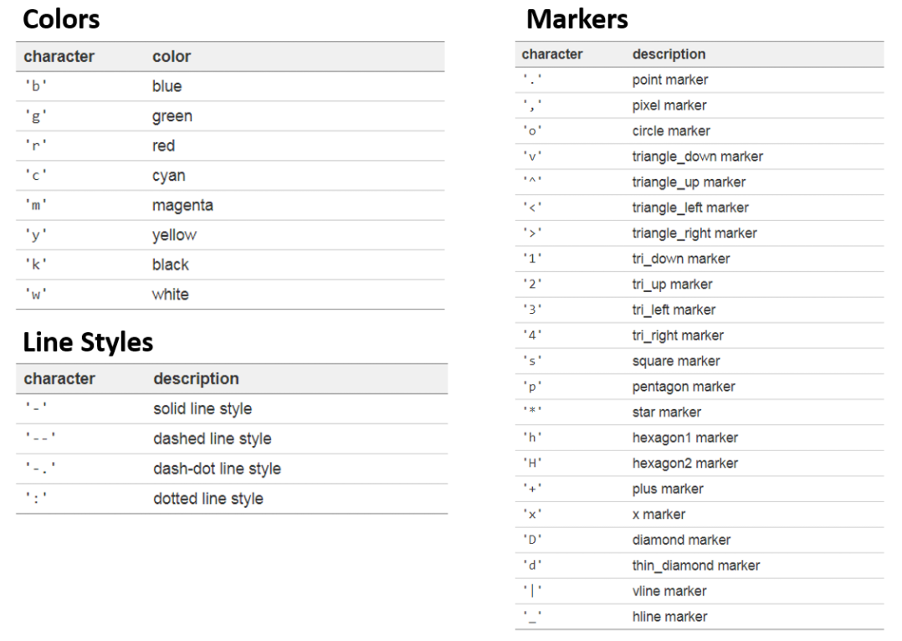

- **선** 

  - **선 모양(linestyle)**
    - ‘ - ‘ (Solid)
    - ‘ - - ‘ (Dashed)
    -  ‘ : ‘ (Dotted)
    -  ‘ -. ‘ (Dash-dot)
  - **선 끝 모양(solid_capstyle, dash_capstyle)**
    - ‘butt’ 뭉뚝한
    -  ‘round’ 둥근 끝 모양

  ```python
  import matplotlib.pyplot as plt
  
  plt.plot([1, 2, 3], [4, 4, 4], linestyle='solid', linewidth=10,
        solid_capstyle='butt', color='C0', label='solid+butt')
  plt.plot([1, 2, 3], [3, 3, 3], linestyle='solid', linewidth=10,
        solid_capstyle='round', color='C0', label='solid+round')
  
  plt.plot([1, 2, 3], [2, 2, 2], linestyle='dashed', linewidth=10,
        dash_capstyle='butt', color='C1', label='dashed+butt')
  plt.plot([1, 2, 3], [1, 1, 1], linestyle='dashed', linewidth=10,
        dash_capstyle='round', color='C1', label='dashed+round')
  
  
  plt.xlabel('X-Axis')
  plt.ylabel('Y-Axis')
  plt.axis([0.8, 3.2, 0.5, 5.0])
  plt.legend(loc='upper right', ncol=2)
  plt.tight_layout()
  plt.show()
  ```

  

  

  

- **마커**

  ```python
  import matplotlib.pyplot as plt
  
  plt.plot([1, 2, 3, 4], [2, 3, 5, 10], 'bo--')     # 파란색 + 마커 + 점선
  plt.xlabel('X-Axis')
  plt.ylabel('Y-Axis')
  plt.show()
  ```

  

- **색상**

  ```python
  import matplotlib.pyplot as plt
  
  # 포맷 문자열 ‘ro’는 빨간색 (‘red’)의 원형 (‘o’) 
  # 포맷 문자열 ‘b-‘는 파란색 (‘blue’)의 실선 (‘-‘)
  plt.plot([1, 2, 3, 4], [1, 4, 9, 16], 'ro')
  # axis() 함수를 이용해서 축의 범위 [xmin, xmax, ymin, ymax]를 지정
  plt.axis([0, 6, 0, 20])
  plt.show()
  ```

  

- **채우기**

  - fill_between() 

    - 두 수평 방향의 곡선 사이를 채웁니다.

    - 두 개의 그래프 사이 영역을 채우기 위해서 두 개의 y 값의 리스트 y1, y2를 입력

    ```python
    import matplotlib.pyplot as plt
    
    x = [1, 2, 3, 4]
    y = [2, 3, 5, 10]
    
    plt.plot(x, y)
    plt.xlabel('X-Axis')
    plt.ylabel('Y-Axis')
    plt.fill_between(x[1:3], y[1:3], alpha=0.5)
    # fill_between() 함수에 x[1:3], y[1:3]를 순서대로 입력하면
    # 네 점 (x[1], y[1]), (x[2], y[2]), (x[1], 0), (x[2], 0)을 잇는 영역이 채워집니다
    plt.show()
    ```

    

  - fill_betweenx() 

    - 두 수직 방방의 곡선 사이를 채웁니다.

    ```python
    import matplotlib.pyplot as plt
    
    x = [1, 2, 3, 4]
    y = [2, 3, 5, 10]
    
    plt.plot(x, y)
    plt.xlabel('X-Axis')
    plt.ylabel('Y-Axis')
    plt.fill_betweenx(y[2:4], x[2:4], alpha=0.5)
    # fill_betweenx() 함수에 y[2:4], x[2:4]를 순서대로 입력하면
    # 네 점 (x[2], y[2]), (x[3], y[3]), (0, y[2]), (0, y[3])을 잇는 영역이 채워집니다
    plt.show()
    ```

    

  - fill() 

    - 각 x, y 점들로 정의되는 다각형 영역을 자유롭게 지정해서 채울 수 있습니다

    ```python
    import matplotlib.pyplot as plt
    
    x = [1, 2, 3, 4]
    y1 = [2, 3, 5, 10]
    y2 = [1, 2, 4, 8]
    
    plt.plot(x, y1)
    plt.plot(x, y2)
    plt.xlabel('X-Axis')
    plt.ylabel('Y-Axis')
    plt.fill([1.9, 1.9, 3.1, 3.1], [1.0, 4.0, 6.0, 3.0], color='lightgray', alpha=0.5)
    
    plt.show()
    ```

    

- **눈금**

  - plt.xticks

  - plt.yticks

    - labels 파라미터를 사용하면 눈금 레이블을 문자열의 형태로 지정

    ```python
    import numpy as np
    
    x = np.arange(0, 2, 0.2)
    
    plt.plot(x, x, 'bo')
    plt.plot(x, x**2, color='#e35f62', marker='*', linewidth=2)
    plt.plot(x, x**3, color='forestgreen', marker='^', markersize=9)
    plt.xticks([0, 1, 2])
    plt.yticks(np.arange(1, 6))
    # X축의 [0, 1, 2]의 위치, Y축의 [1, 2, 3, 4, 5]의 위치에 눈금
    # plt.xticks(np.arange(0, 2, 0.2), labels=['Jan', '', 'Feb', '', 'Mar', '', 'May', '', 'June', '', 'July'])
    # plt.yticks(np.arange(0, 7), ('0', '1GB', '2GB', '3GB', '4GB', '5GB', '6GB'))
    
    
    plt.show()
    ```

    

  - tick_params() 

    - axis : 설정이 적용될 축
    - direction : ‘in’, ‘out’,  ‘inout’으로 설정하면 눈금이 안/밖으로 표시
    - length : 눈금의 길이
    - labelsize : 레이블의 크기
    - labelcolor : 레이블의 색상
    - width : 눈금의 너비
    - color : 눈금의 색상

    ```python
    import matplotlib.pyplot as plt
    import numpy as np
    
    x = np.arange(0, 2, 0.2)
    
    plt.plot(x, x, 'bo')
    plt.plot(x, x**2, color='#e35f62', marker='*', linewidth=2)
    plt.plot(x, x**3, color='springgreen', marker='^', markersize=9)
    
    # xticks 및 yticks
    plt.xticks(np.arange(0, 2, 0.2), labels=['Jan', '', 'Feb', '', 'Mar', '', 'May', '', 'June', '', 'July'])
    plt.yticks(np.arange(0, 7), ('0', '1GB', '2GB', '3GB', '4GB', '5GB', '6GB'))
    
    # tick_params
    plt.tick_params(axis='x', direction='in', length=3, pad=6, labelsize=14, labelcolor='green', top=True)
    plt.tick_params(axis='y', direction='inout', length=10, pad=15, labelsize=12, width=2, color='r')
    
    plt.show()
    ```

    

### 3. Tensorflow

#### (1) 정의

- 구글에서 제공하는 머신 러닝을 위한 End-to-End 오픈소스 플랫폼
- 연산과정을 그래프의 형태로 정의하고 그 후에 그래프에 값을 전달하는 방식으로 동작
- Tensorboard 라는 시각화 툴을 제공하여 학습 과정 및 연산 그래프, 결과를 확인하기 쉽게 되어 있다

#### (2) intsall

```python
!pip install -q tensorflow-gpu==2.0.0-rc1
```

#### (3) import

```python
import tensorflow as tf
```

#### (4) 데이터셋 로드

- 샘플 값을 정수에서 **부동소수로 변환**

```python
mnist = tf.keras.datasets.mnist

(x_train, y_train), (x_test, y_test) = mnist.load_data()
x_train, x_test = x_train / 255.0, x_test / 255.0
```

#### (5) Sequential 모델

- 훈련에 사용할 **옵티마이저(optimizer)**와 **손실 함수**를 선택

```python
model = tf.keras.models.Sequential([
  tf.keras.layers.Flatten(input_shape=(28, 28)),
  tf.keras.layers.Dense(128, activation='relu'),
  tf.keras.layers.Dropout(0.2),
  tf.keras.layers.Dense(10, activation='softmax')
])

model.compile(optimizer='adam',
              loss='sparse_categorical_crossentropy',
              metrics=['accuracy'])
```

#### (6) 훈련 및 평가

- 훈련된 이미지 분류기는 이 데이터셋에서 약 98%의 정확도를 달성

```python
model.fit(x_train, y_train, epochs=5)
model.evaluate(x_test,  y_test, verbose=2)

'''
Train on 60000 samples
60000/60000 [==============================] - 4s 68us/sample - loss: 0.2941 - accuracy: 0.9140
Epoch 2/5
60000/60000 [==============================] - 4s 62us/sample - loss: 0.1396 - accuracy: 0.9587
Epoch 3/5
60000/60000 [==============================] - 4s 62us/sample - loss: 0.1046 - accuracy: 0.9680
Epoch 4/5
60000/60000 [==============================] - 4s 62us/sample - loss: 0.0859 - accuracy: 0.9742
Epoch 5/5
60000/60000 [==============================] - 4s 62us/sample - loss: 0.0724 - accuracy: 0.9771
10000/1 - 0s - loss: 0.0345 - accuracy: 0.9788
[0.06729823819857557, 0.9788]
'''
```


### 4. Keras 

#### (1) 정의

-  Tensorflow, CNTK, Theano 와 같은 Deep Learning 라이브러리 위에서 실행할 수 있는 High-level Neural Network API 
- 빠르게 딥 러닝 연구 및 실험을 가능하게 하는데 중점을 두고 개발
- 개발 시간을 최소화하고 빠르게 결과를 도출할 수 있다는 장점
- 모듈성과 쉬운 확장성을 가지고 있어 현재 널리 사용

#### (2) intsall

```python
pip install keras
```

#### (3) import

```python
import tensorflow as tf
from keras.models import Sequential
from tensorflow import keras
from tensorflow.keras import layers
```

#### (4) Sequential 모델

- `.add()`를 통해 레이어를 간단하게 쌓을 수 있습니다

```python
from keras.models import Sequential
from keras.layers import Dense

#1 모델 생성
model = keras.Sequential(
    [
        layers.Dense(2, activation="relu"),
        layers.Dense(3, activation="relu"),
        layers.Dense(4),
    ]
)

#2 모델 생성
model = Sequential()
model.add(Dense(units=64, activation='relu', input_dim=100))
model.add(Dense(units=10, activation='softmax'))

#3 모델 생성
model = keras.Sequential()
model.add(layers.Dense(2, activation="relu"))
model.add(layers.Dense(3, activation="relu"))
model.add(layers.Dense(4))

# 모델 제거
model.pop()
print(len(model.layers))  
```

#### (5) Sequential 모델

- `.compile()`
  - 학습 과정을 조정
  - 옵티마이저를 조정

```python
# 학습 과정을 조정
model.compile(loss='categorical_crossentropy',
              optimizer='sgd',
              metrics=['accuracy'])
# 옵티마이저를 조정
model.compile(loss=keras.losses.categorical_crossentropy,
              optimizer=keras.optimizers.SGD(lr=0.01, momentum=0.9, nesterov=True))
```

#### (6) 훈련 및 평가

- `.fit()` 레이닝 데이터에 대한 반복작업을 수행
- `.evaluate()` 코드 한 줄로 모델의 성능을 평가
- `.predict()`새로운 데이터에 대해서 예측 결과를 생성

```python
# x_train and y_train are Numpy arrays --just like in the Scikit-Learn API.
model.fit(x_train, y_train, epochs=5, batch_size=32)
loss_and_metrics = model.evaluate(x_test, y_test, batch_size=128)
classes = model.predict(x_test, batch_size=128)
```


### 5. Argparse


## 개발 환경 구성

### 1. Anaconda

#### (1) 가상환경 생성 및 활성화

```bash
conda create -n AI python=3.7
conda activate AI
```


### 2. Tensorflow

#### (1) AI 가상환경에서 Tensorflow 및 필요 라이브러리 설치

```bash
conda install git matplotlib scikit-learn tqdm scipy numpy tensorflow-gpu==2.0.0
```

#### (2) 라이브러리

- matplotlib 
- numpy 
- tensorflow
- scikit-learn 
- tqdm 
- scipy 
